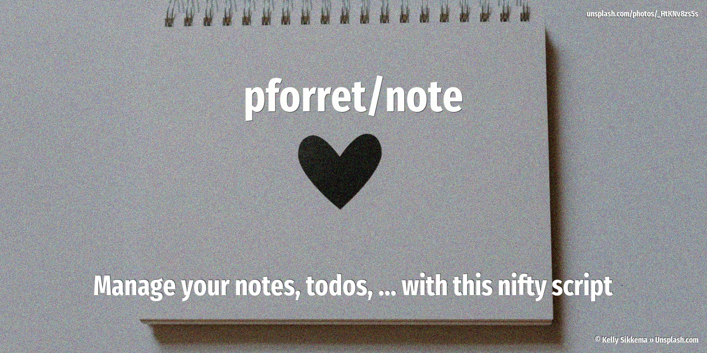

# pforret/note

Manage your notes, todo, ... with this nifty script (100% bash)

## Usage

    Program: note 1.1.0 by peter@forret.com
    Updated: 2020-12-14 23:00
    Usage: note [-h] [-q] [-v] [-f] [-n <note_dir>] [-l <log_dir>] <action> <input …>
    Flags, options and parameters:
        -h|--help      : [flag] show usage [default: off]
        -q|--quiet     : [flag] no output [default: off]
        -v|--verbose   : [flag] output more [default: off]
        -f|--force     : [flag] do not ask for confirmation (always yes) [default: off]
        -n|--note_dir <val>: [optn] folder for note files   [default: /home/forretp/.note]
        -l|--log_dir <val>:  [optn] folder for log files    [default: /home/forretp/.note/.log]
        <action>  : [parameter] action to perform: add/edit/find/list/paste/show
        <input>   : [parameter] text to add (optional)
    
    ### EXAMPLES
    * use `note add XYZ` to add one line/thought to your note file
      note add "line of text"
    * use `note find XYZ` to find a word/phrase in your note files
      note find "DEVL"
    * use `note edit` to open your current note file in your default editor
      note edit
    * use `note list` to show a list of all your note files with some stats
      note list
    * use `note paste` to paste the clipboard into your note file
      note paste
    * use `note show` to show today's note file
      note show
      

## Installation

with [basher](https://github.com/basherpm/basher)

	$ basher install pforret/note

or with `git`

	$ git clone https://github.com/pforret/note.git
	$ cd note

## Acknowledgements

* script created with [bashew](https://github.com/pforret/bashew)

&copy; 2020 Peter Forret
