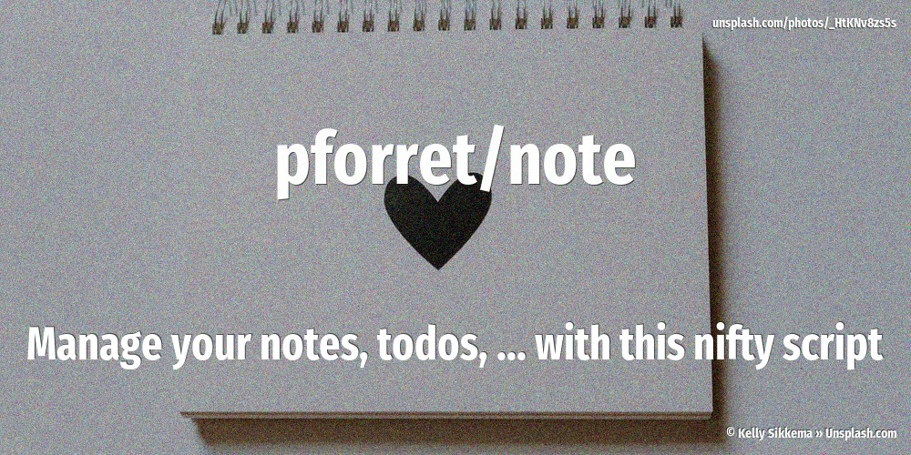

[](https://basher.gitparade.com/package/)

# pforret/note



Manage your notes, todo, ... with this nifty script (100% bash)

## Usage

```
### USAGE
Program: note 1.3.0 by peter@forret.com
Updated: Feb  5 21:57:53 2021
Description: keep track of daily notes
Usage: note [-h] [-q] [-v] [-f] 
            [-n <note_dir>] [-l <log_dir>] 
            [-e <extension>] [-t <editor>] [-p <prefix>] [-z <postfix>] 
            <action> <input?>
Flags, options and parameters:
    -h|--help        : [flag] show usage [default: off]
    -q|--quiet       : [flag] no output [default: off]
    -v|--verbose     : [flag] output more [default: off]
    -f|--force       : [flag] do not ask for confirmation (always yes) [default: off]
    -n|--note_dir <?>: [option] folder for note files   [default: /Users/pforret/notes]
    -l|--log_dir <?> : [option] folder for log files   [default: /Users/pforret/log/note]
    -e|--extension <?>: [option] extension for note files  [default: md]
    -t|--editor <?>  : [option] text editor to use  [default: vi]
    -p|--prefix <?>  : [option] data to enter before the note
    -z|--postfix <?> : [option] data to enter after the note  [default: pforret@Mac-mini.forret]
    <action>         : [parameter] action to perform: add/edit/find/list/paste/show/check
    <input>          : [parameter] text to add/search (optional)

### TIPS & EXAMPLES
* use note add XYZ to add one line/thought to your note file
  note add "line of text"
* use note find XYZ to find a word/phrase in your note files
  note find "DEVL"
* use note edit to open your current note file in your default editor
  note edit
* use note list to show a list of all your note files with some stats
  note list
* use note show to show today's note file
  note show
* use note paste to paste the clipboard into your note file
  note paste
* use note check to check if this script is ready to execute and what values the options/flags are
  note check
```      

## Installation

with [basher](https://github.com/basherpm/basher)

```bash
basher install pforret/note
```

or with `git`

```bash
$ git clone https://github.com/pforret/note.git
$ cd note
$ sudo ln -s $(pwd)/note /usr/local/bin/ # or somewhere else in your path
```

## Acknowledgements

* script created with [bashew](https://github.com/pforret/bashew)

&copy; 2020 Peter Forret
